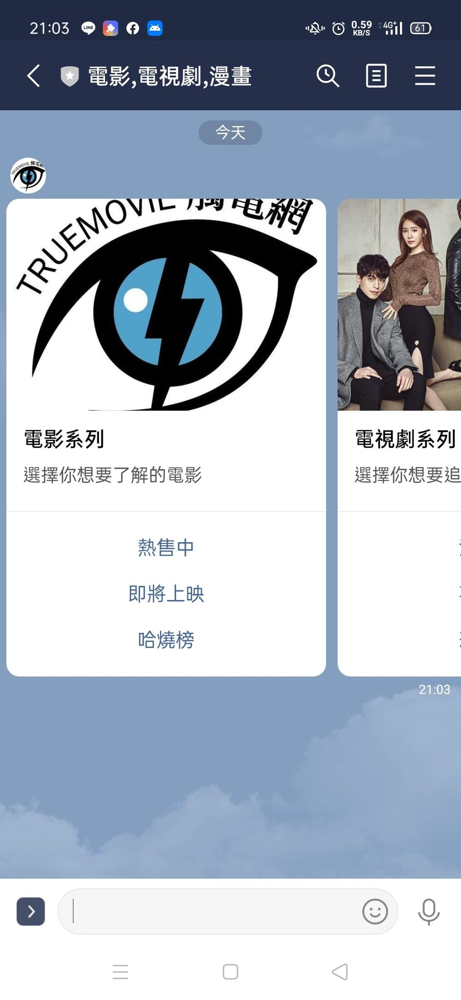
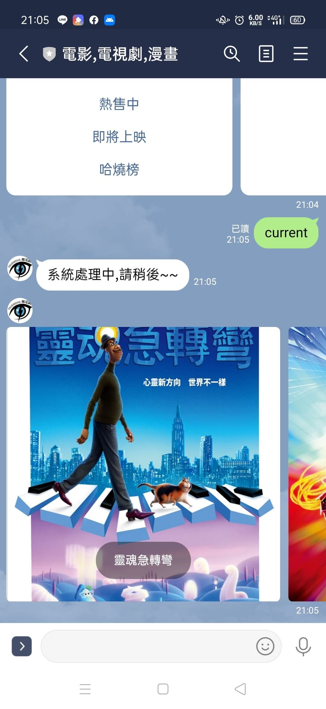
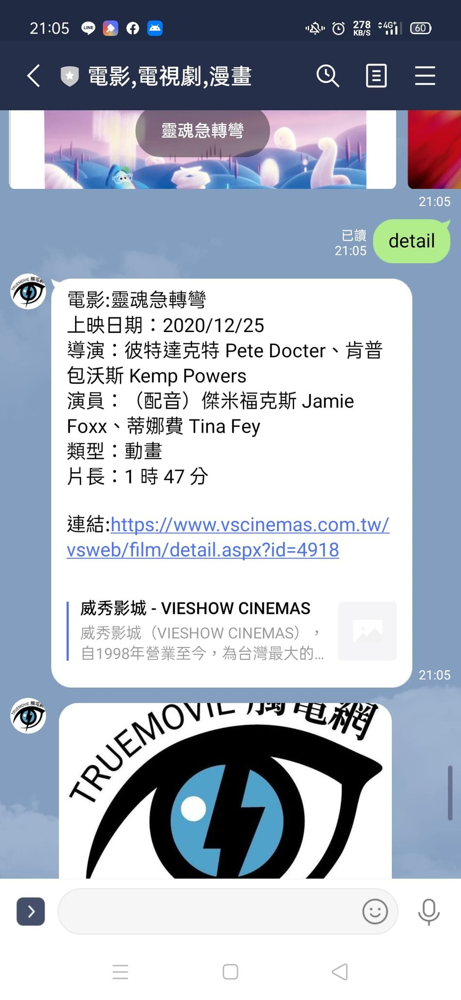
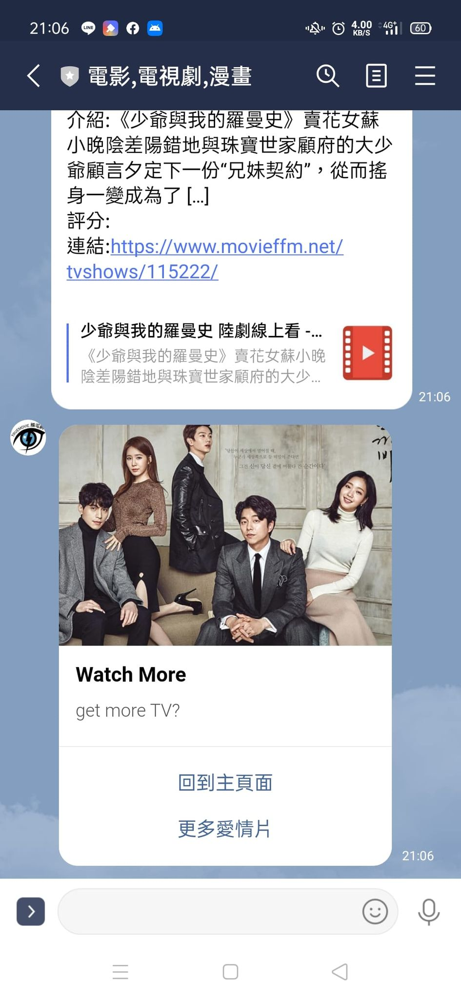
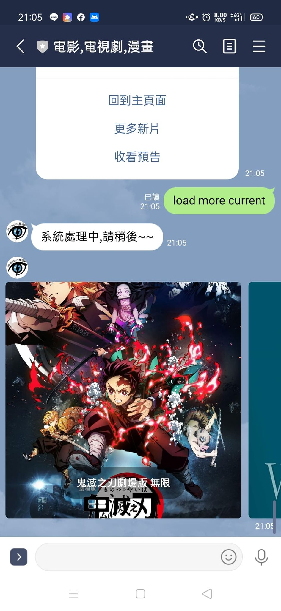
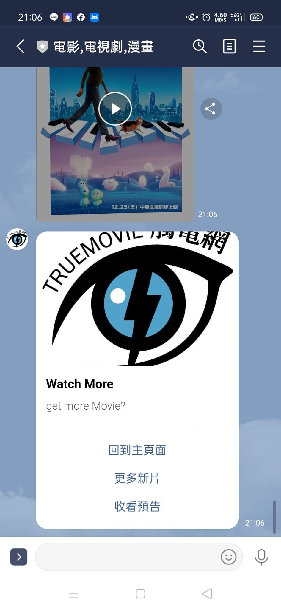
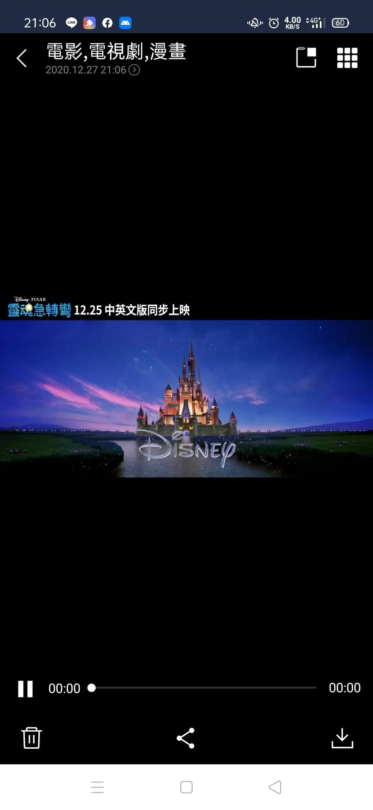
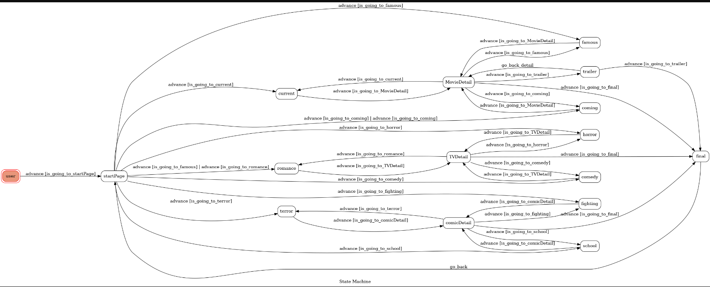

# Movie LineBot

Line Bot for watch TV,Movie,comic detail and trailer online

A Line bot based on a finite state machine

# Features

## Choose type

Choose type you want to watch

    

## Choose Movie/TV/Comic

system will load three Movie/TV/Comic,choose you want!
and when you tap the image,system will show the detail for Movie/TV/Comic

    
    

## detail for Movie/TV/Comic

    
    

## Load more Movie/TV/Comic

you can load more three Movie/TV/Comic for "更多新片"

    

## Watch Trail

because movie is newest,so you only can see trailer
Fortunately,I just help you to download movie into linebot
so you can see movie trailer in line directly!

    
    

## Back to Main Page

back to main page

# fsm image

    

